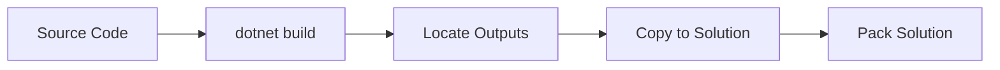

# Features Guide

Deep dive into PPDS ALM v2's advanced features.

## Smart Import

The `import-solution` action includes intelligent features that prevent unnecessary deployments and handle transient failures gracefully.

### Version Comparison

Before importing, the action:

1. **Extracts version** from the solution zip file (parses `Other/Solution.xml`)
2. **Queries target environment** for the existing solution version
3. **Compares versions** using semantic version comparison
4. **Skips import** if target version is same or newer

**Why This Matters:**
- Prevents redundant deployments
- Saves time when multiple pipelines target the same environment
- Handles concurrent deployment scenarios gracefully

**Example Scenario:**
```
Import version: 1.2.3.4
Target version: 1.2.3.4
Result: Import skipped (version match)
```

**To Disable:**
```yaml
- uses: joshsmithxrm/ppds-alm/.github/actions/import-solution@v2
  with:
    solution-path: ./MySolution_managed.zip
    skip-if-same-version: 'false'  # Force import regardless of version
```

### Retry Logic

The import action intelligently retries only **transient** failures.

**Transient Errors (Retried):**
- "Cannot start another solution at the same time"
- Concurrent import conflicts
- "Try again later" messages

**Deterministic Errors (Fail Immediately):**
- File not found
- Missing dependencies
- Access denied
- Invalid solution structure

**Retry Behavior:**
1. First attempt fails with transient error
2. Wait `retry-delay-seconds` (default: 300 = 5 minutes)
3. **Re-check version** before retry (another process may have succeeded)
4. Retry up to `max-retries` times
5. If version check shows success, skip retry and report success

**Configuration:**
```yaml
- uses: joshsmithxrm/ppds-alm/.github/actions/import-solution@v2
  with:
    solution-path: ./MySolution_managed.zip
    max-retries: '3'
    retry-delay-seconds: '300'  # 5 minutes between retries
```

### Deployment Settings

The import action supports Power Platform deployment settings files for environment-specific configuration.

**What Deployment Settings Configure:**
- Connection references
- Environment variables
- Component ownership

**Usage:**
```yaml
- uses: joshsmithxrm/ppds-alm/.github/actions/import-solution@v2
  with:
    solution-path: ./MySolution_managed.zip
    settings-file: ./config/qa.deploymentsettings.json
```

**Auto-Detection:**
When using `solution-deploy.yml`, settings files are auto-detected:
1. `./config/{SolutionName}.{EnvironmentName}.deploymentsettings.json`
2. `./config/{SolutionName}.deploymentsettings.json`
3. `{solution-folder}/../config/{SolutionName}.deploymentsettings.json`

**Creating Deployment Settings:**
```bash
pac solution create-settings --solution-zip MySolution_managed.zip --settings-file MySolution.deploymentsettings.json
```

---

## Noise Filtering

Power Platform solution exports often contain changes that aren't real customizations - volatile values that change on every export.

### The Problem

Without noise filtering, your git history becomes polluted with meaningless commits:
- "Sync solution" - only version timestamp changed
- "Export update" - only session IDs regenerated
- "Nightly sync" - only whitespace differences

This makes it hard to:
- Review actual changes in PRs
- Track when real customizations were made
- Identify the cause of issues

### The Solution

The `analyze-changes` action examines each file change and categorizes it as "noise" or "real".

**Noise Patterns Detected:**

| Pattern | Example | Why It's Noise |
|---------|---------|----------------|
| Version-only changes | `<Version>1.0.0.1</Version>` | Auto-incremented on every export |
| Canvas App URIs | `DocumentUri: "...?suffix=abc123"` | Random suffix changes each export |
| Workflow session IDs | `workflowName: "session_xxx"` | Regenerated every export |
| Whitespace changes | Trailing spaces, line endings | No functional impact |
| R100 renames | File renamed, 100% identical content | Git metadata noise |
| Dependency versions | `<MissingDependency>` references | System version updates |

### Usage

```yaml
# Stage all changes first
- run: git add -A

# Analyze for noise
- id: analyze
  uses: joshsmithxrm/ppds-alm/.github/actions/analyze-changes@v2
  with:
    solution-folder: solutions/MySolution/src
    debug: 'false'

# Only commit if real changes exist
- if: steps.analyze.outputs.has-real-changes == 'true'
  run: |
    git commit -m "chore: sync solution from Dev"
    git push

- if: steps.analyze.outputs.has-real-changes == 'false'
  run: |
    echo "No real changes detected - skipping commit"
    git reset HEAD
```

### Debug Mode

Enable debug mode to see detailed analysis:

```yaml
- uses: joshsmithxrm/ppds-alm/.github/actions/analyze-changes@v2
  with:
    solution-folder: solutions/MySolution/src
    debug: 'true'
```

Output includes:
- Each file analyzed
- Why it was categorized as noise or real
- Full list of noise files filtered

---

## Solution Checker Integration

PowerApps Solution Checker validates solution quality by analyzing for:
- Unsupported customizations
- Performance issues
- Security vulnerabilities
- Deprecated APIs
- Best practice violations

### Severity Levels

| Level | Description | Typical Action |
|-------|-------------|----------------|
| Critical | Blocking issues | Must fix before deployment |
| High | Serious problems | Should fix promptly |
| Medium | Moderate issues | Review and plan fixes |
| Low | Minor concerns | Fix when convenient |
| Informational | Best practices | Consider implementing |

### Configuration Options

**Fail on Different Thresholds:**
```yaml
# Strict: Fail on any High or Critical issue
- uses: joshsmithxrm/ppds-alm/.github/actions/check-solution@v2
  with:
    solution-path: ./MySolution_managed.zip
    fail-on-level: High

# Lenient: Only fail on Critical issues
- uses: joshsmithxrm/ppds-alm/.github/actions/check-solution@v2
  with:
    solution-path: ./MySolution_managed.zip
    fail-on-level: Critical

# Very Lenient: Just report, never fail
# (set fail-on-level to something that won't match)
```

**Geography Selection:**

Choose the geography closest to your environment:
```yaml
- uses: joshsmithxrm/ppds-alm/.github/actions/check-solution@v2
  with:
    solution-path: ./MySolution_managed.zip
    geography: europe  # or unitedstates, asia, australia, etc.
```

**Rule Level Override:**

Customize severity of specific rules:
```yaml
- uses: joshsmithxrm/ppds-alm/.github/actions/check-solution@v2
  with:
    solution-path: ./MySolution_managed.zip
    rule-level-override: ./config/checker-rules.json
```

### SARIF Output

Results are output in SARIF format, which:
- Can be uploaded to GitHub Code Scanning
- Works with various SARIF viewers
- Provides detailed issue locations

```yaml
- uses: joshsmithxrm/ppds-alm/.github/actions/check-solution@v2
  id: check
  with:
    solution-path: ./MySolution_managed.zip

# Upload results to GitHub Security tab
- uses: github/codeql-action/upload-sarif@v3
  if: always()
  with:
    sarif_file: ${{ steps.check.outputs.results-file }}
```

---

## Build Pipeline

The build actions support full .NET solution compilation with automatic plugin integration.

### Build Workflow



### Plugin Types Supported

**Classic Plugin Assemblies:**
- Single DLL containing all plugins
- Target: `PluginAssemblies/{AssemblyName}-{GUID}/`
- Naming: `MyProject.Plugins.dll` → `MyProjectPlugins.dll`

**Plugin Packages (NuGet-based):**
- Modern plugin deployment format
- Target: `pluginpackages/{PackageId}/package/`
- Naming: `MyPackage.1.0.0.nupkg` → `MyPackage.nupkg`

### Automatic Output Location

The build action finds outputs automatically based on folder conventions:

```
src/
├── Plugins/                    # Classic plugin projects
│   └── MyProject.Plugins/
│       └── bin/Release/net462/
│           └── MyProject.Plugins.dll  ← Found automatically
├── PluginPackages/             # Plugin package projects
│   └── MyProject.PluginPackage/
│       └── bin/Release/
│           └── MyPackage.1.0.0.nupkg  ← Found automatically
└── Shared/                     # Shared projects
    └── MyProject.Entities/
        └── bin/Release/
            └── MyProject.Entities.dll  ← Found automatically
```

### Test Execution

Run unit tests as part of the build:

```yaml
- uses: joshsmithxrm/ppds-alm/.github/actions/build-solution@v2
  with:
    solution-path: MySolution.sln
    run-tests: 'true'
    test-filter: 'Category=Unit'  # Optional: filter tests
```

Test results are reported in the workflow summary.

---

## PAC CLI Workarounds

### Linux `--allowDelete` Bug

**Problem:** PAC CLI's `--allowDelete` flag doesn't work on Linux runners. Files that should be deleted remain in the repository.

**Impact:** Removed solution components (plugins, entities, etc.) persist in source control after export.

**Workaround:** The `export-solution` action:
1. Deletes the solution folder before unpack
2. Runs unpack without relying on `--allowDelete`
3. Restores from git if unpack fails

**Bug Reference:** https://github.com/microsoft/powerplatform-build-tools/issues/448

### Version Pinning

PAC CLI updates can introduce breaking changes. Pin versions for stability:

```yaml
- uses: joshsmithxrm/ppds-alm/.github/actions/setup-pac-cli@v2
  with:
    pac-version: '1.35.5'  # Known working version
```

Find versions at: https://www.nuget.org/packages/Microsoft.PowerApps.CLI.Tool

---

## Best Practices

### Use Reusable Workflows for Standard Scenarios

```yaml
# Simple: use pre-built workflow
jobs:
  deploy:
    uses: joshsmithxrm/ppds-alm/github/workflows/solution-deploy.yml@v2
```

### Use Composite Actions for Custom Scenarios

```yaml
# Complex: compose your own workflow
jobs:
  custom:
    steps:
      - uses: joshsmithxrm/ppds-alm/.github/actions/setup-pac-cli@v2
      - uses: joshsmithxrm/ppds-alm/.github/actions/pac-auth@v2
      # ... custom steps ...
```

### Pin Versions in Production

```yaml
# Development: use major version
uses: joshsmithxrm/ppds-alm/github/workflows/solution-deploy.yml@v2

# Production: pin specific version
uses: joshsmithxrm/ppds-alm/github/workflows/solution-deploy.yml@v2.0.0
```

### Separate Environments with GitHub Environments

```yaml
jobs:
  deploy-qa:
    environment: QA
    # Uses QA-specific vars and secrets

  deploy-prod:
    environment: Prod
    # Uses Prod-specific vars and secrets
```

## See Also

- [Actions Reference](./actions-reference.md) - Detailed input/output documentation
- [GitHub Quickstart](./github-quickstart.md) - Getting started guide
- [Strategy Guides](./strategy/ALM_OVERVIEW.md) - ALM philosophy and patterns
